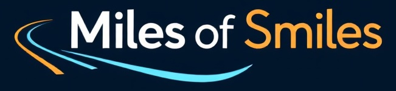

# Algemene voorwaarden - Miles of Smiles

**Versie:** 1.0
**Datum:** 26 september 2025

---

## 1. Inleiding
Welkom bij **Miles of Smiles**, een autoverhuurder die zich inzet voor kwaliteit, veiligheid en klanttevredenheid. Door gebruik te maken van onze diensten, gaat u akkoord met deze Algemene Voorwaarden. Lees ze aandachtig door.

---

## 2. Definities
- **Miles of Smiles**: De autoverhuurder en eigenaar van deze website/dienst.
- **Klant**: De persoon of organisatie die een voertuig huurt.
- **Voertuig**: Elk motorvoertuig dat door Miles of Smiles wordt verhuurd.
- **Huurperiode**: De periode waarvoor het voertuig is gehuurd, zoals vermeld in de huurovereenkomst.

---

## 3. Reservering en Betaling
- Reserveringen kunnen online, telefonisch of bij een van onze vestigingen worden gemaakt.
- Betaling dient te geschieden volgens de gekozen betaalmethode (creditcard, iDEAL, etc.).
- Annuleringen moeten minimaal 48 uur voor aanvang van de huurperiode plaatsvinden om kosten te vermijden.

---

## 4. Gebruik van het Voertuig
- Het voertuig mag alleen worden bestuurd door de in de huurovereenkomst genoemde bestuurder(s).
- Het voertuig mag niet worden gebruikt voor illegale doeleinden of deelname aan races.
- Schade, diefstal of boetes tijdens de huurperiode zijn de verantwoordelijkheid van de klant, tenzij anders overeengekomen.
- Verdere gebruikersvoorwaarden zijn opgenomen in onze [Gebruikersvoorwaarden](Gebruiksvoorwaarden_Miles_of_Smiles.md).

---

## 5. Verzekering
- Miles of Smiles biedt standaard een WA-verzekering. Optionele aanvullende verzekeringen zijn beschikbaar.
- Eigen risico en uitzonderingen zijn vermeld in de verzekeringsvoorwaarden, die op aanvraag beschikbaar zijn.

---

## 6. Privacy
- Persoonsgegevens worden verwerkt volgens ons [privacybeleid](Privacybeleid_Miles_of_Smiles.md).
- Gegevens worden alleen gebruikt voor het afhandelen van reserveringen en klantenservice.

---

## 7. Aansprakelijkheid
- Miles of Smiles is niet aansprakelijk voor indirecte schade, zoals gederfde winst of gemiste kansen.
- Aansprakelijkheid voor directe schade is beperkt tot het bedrag dat door de verzekering wordt gedekt.

---

## 8. Geschillen
- Geschillen worden in eerste instantie besproken met de klantenservice.
- Indien geen oplossing wordt gevonden, kan de klant zich wenden tot de Geschillencommissie Autohuur.

---

## 9. Wijzigingen
- Miles of Smiles behoudt zich het recht voor om deze voorwaarden te wijzigen. Klanten worden hiervan op de hoogte gesteld via onze website of e-mail.

---
