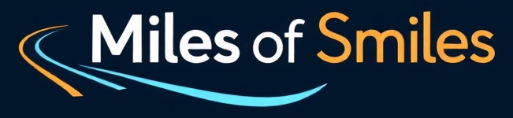

# Cookiebeleid - Miles of Smiles

**Versie:** 1.0
**Datum:** 26 september 2025

---

## 1. Inleiding
Miles of Smiles maakt gebruik van cookies en vergelijkbare technologieën om de functionaliteit en gebruikerservaring van onze website te verbeteren. In dit cookiebeleid leggen wij uit welke cookies wij gebruiken, waarom wij ze gebruiken en hoe u uw instellingen kunt beheren.

---

## 2. Wat zijn cookies?
Cookies zijn kleine tekstbestanden die op uw apparaat (computer, tablet of mobiele telefoon) worden opgeslagen wanneer u onze website bezoekt. Ze helpen ons om uw voorkeuren te onthouden, de website efficiënter te laten werken en informatie te verzamelen over hoe u onze website gebruikt.

---

## 3. Welke cookies gebruiken wij?

### 3.1. Noodzakelijke cookies
Deze cookies zijn essentieel voor het functioneren van onze website. Ze zorgen ervoor dat u onze website kunt bezoeken en gebruik kunt maken van de functies, zoals het reserveren van een voertuig. Zonder deze cookies kunnen bepaalde diensten niet worden geleverd.

- **Doel:** Functioneel en veilig gebruik van de website.
- **Voorbeelden:** Sessiecookies, inlogcookies.

### 3.2. Prestatiecookies
Deze cookies helpen ons om de prestaties van onze website te analyseren en te verbeteren. Ze verzamelen informatie over hoe bezoekers onze website gebruiken, zoals welke pagina's het meest worden bezocht en of er foutmeldingen optreden.

- **Doel:** Verbeteren van de gebruikerservaring.
- **Voorbeelden:** Google Analytics-cookies.

### 3.3. Functionele cookies
Deze cookies onthouden uw voorkeuren en keuzes om uw ervaring op onze website te personaliseren. Bijvoorbeeld het onthouden van uw taalvoorkeur of het opslaan van uw inloggegevens voor toekomstige bezoeken.

- **Doel:** Personalisatie van de gebruikerservaring.
- **Voorbeelden:** Taalvoorkeurcookies, inloggegevenscookies.

### 3.4. Marketing- en trackingcookies
Deze cookies worden gebruikt om u gepersonaliseerde advertenties te tonen en om het effect van onze marketingcampagnes te meten. Ze kunnen ook worden gebruikt om uw surfgedrag op verschillende websites te volgen.

- **Doel:** Gepersonaliseerde advertenties en marketinganalyses.
- **Voorbeelden:** Facebook Pixel, Google Ads-cookies.

---

## 4. Hoe kunt u uw cookie-instellingen beheren?
U kunt uw cookievoorkeuren op elk moment wijzigen via de cookie-instellingsknop op onze website. Daarnaast kunt u uw browser instellen om cookies te weigeren of te verwijderen. Houd er rekening mee dat het uitschakelen van bepaalde cookies de functionaliteit van onze website kan beïnvloeden.

- **Browserinstellingen:** U kunt cookies beheren via de instellingen van uw browser (bijv. Chrome, Firefox, Safari).
- **Opt-out tools:** Voor marketingcookies kunt u gebruikmaken van opt-out tools zoals [Your Online Choices](https://www.youronlinechoices.com/) of [Network Advertising Initiative](https://www.networkadvertising.org/).

---

## 5. Wijzigingen in dit cookiebeleid
Dit cookiebeleid kan periodiek worden bijgewerkt om wijzigingen in onze praktijken of wettelijke vereisten weer te geven. Eventuele wijzigingen worden op onze website gepubliceerd. We raden u aan dit beleid regelmatig te raadplegen.

---

## 6. Contact
Als u vragen heeft over ons cookiebeleid, kunt u contact met ons opnemen via:
- **E-mail:** privacy@milesofsmiles.nl
- **Telefoon:** +31 (0)XX XXX XXXX

---
